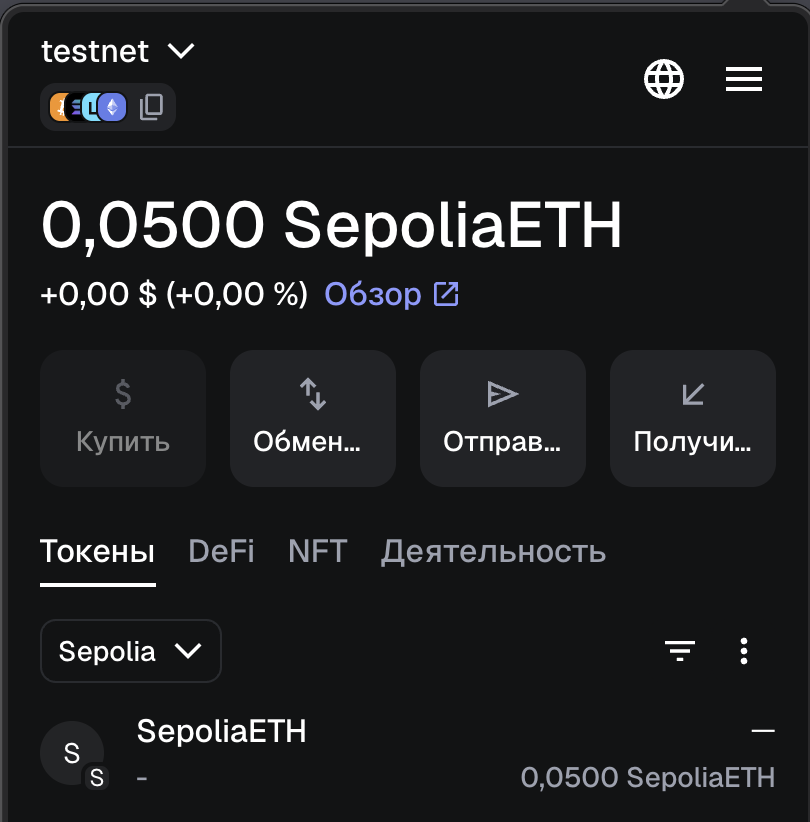
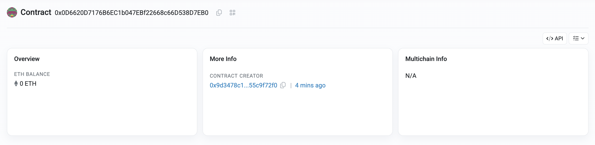
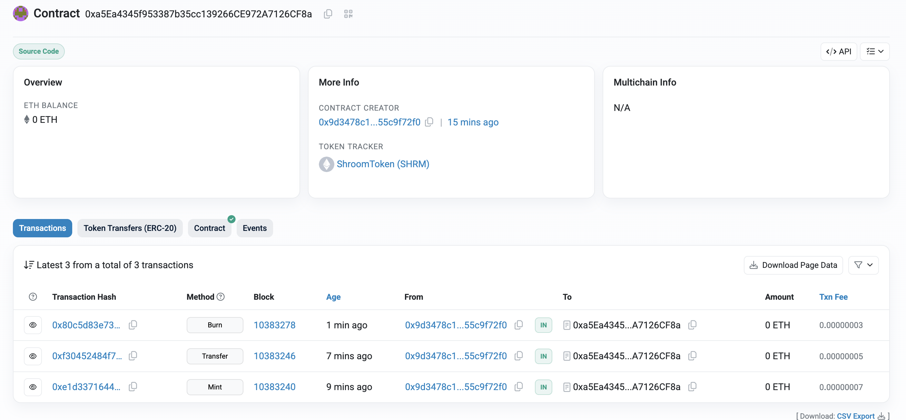

# Install dependencies

```
git submodule update --init --recursive
```

```
python3 -m venv .venv
source .venv/bin/activate
pip install -r requirements.txt
```

## Compile contract

```
python3 scripts/compile_contract.py
```

## Deploy contract

```
python3 scripts/deploy_contract.py
```

## Test contract

```
python3 scripts/interact_contract.py
```

# Description 

1. Kutergin Fedor (0x9d3478c1deA23064a72d5405FAB5d5955c9f72f0)
2. Ioffe Alexander (0x53Cb4c128B7dc3CD1F763aC011dE34817a23f244)
3. Chernyaev Maxim (0x6f597922E1225e3ac3Ab802c5aa9056ed9672201)

CHAIN_ID=11155111 - sepolia testnet

1. Got ETH from faucet https://cloud.google.com/application/web3/faucet/ethereum/sepolia



2. Compiled contract
3. Deployed contract

```
Transaction sent, hash: 40e9ac3fc1de689035ff0940c757c2ba9ce7c5ec15c66519639c89739bda322a
Contract deployed: 0xa5Ea4345f953387b35cc139266CE972A7126CF8a
```

https://sepolia.etherscan.io/address/0xa5Ea4345f953387b35cc139266CE972A7126CF8a



4. Tested contract

```
>> python3 interact_contract.py balance  
<< Balance: 0 SHRM
```

```
>> python3 interact_contract.py mint 10000
<< Minted, hash: e1d3371644c33837bc65d2aa3d1f311730e10d85a82cbdedab682b64993e05e3
<< Confirmed
```

```
>>> python3 interact_contract.py transfer 0x53Cb4c128B7dc3CD1F763aC011dE34817a23f244 10
<<< Sent, hash: f30452484f7639fa79f42c2d6cdc0e10cf971fb512ffc9e3a940fb64f99fecad
<<< Confirmed
```

```
>>> python3 interact_contract.py balance  
<<< Balance: 9990 SHRM
```

```
>>> python3 interact_contract.py burn 500
<<< Burned, hash: 80c5d83e73a82e983f72fb1f22244208c9e557e092e455d66f5c2d7888c0d69c
<<< Confirmed
```

```
>>> python3 interact_contract.py balance
<<< Balance: 9490 SHRM
```


